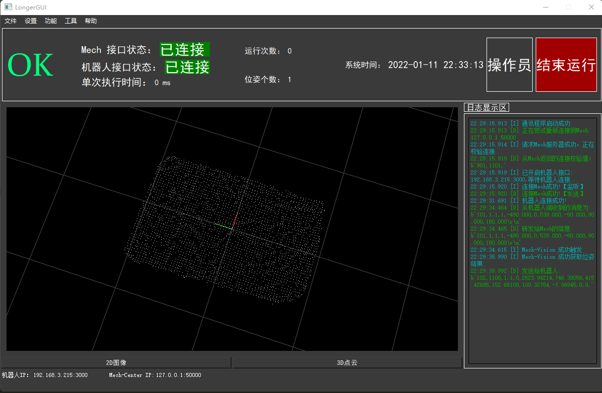
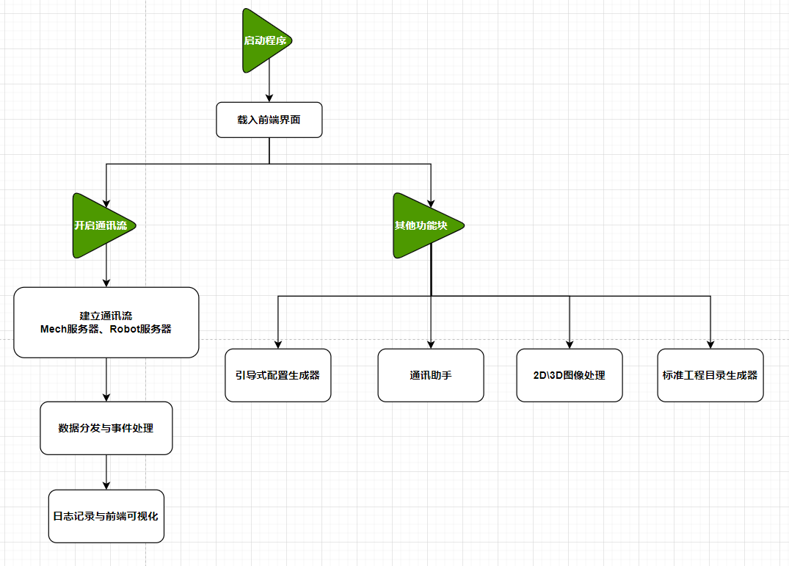
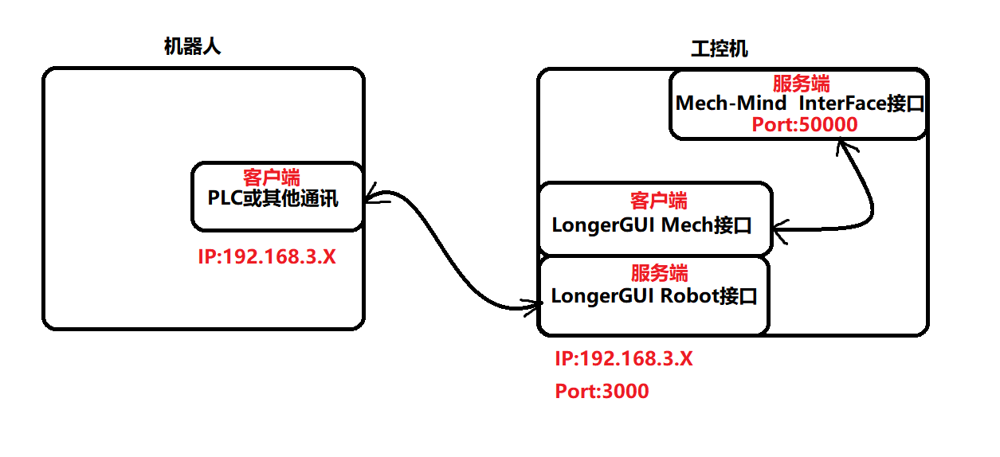

# LongerGUI 开发者快速手册 ( V0.1.1-Alpha )


## 一、项目概况

**项目简介：**LongerGUI是一款 Mech-Mind 的小工具，可进行数据处理与分析，帮助客户更直观的获取所需的生产信息

**项目仓库地址：**https://gitee.com/Derkai52/longer-gui.git

**软件运行示例图：**




### 相关资料说明

**《LongerGUI快速手册》：快速了解项目概况的说明书**

**《LongerGUI详细设计手册》：设计环节中的思考与关键代码讲解**

**《LongerGUI二次开发手册》：用于开发者在已有接口或功能点上进行定制化修改**


### 版本更新记录

| 发布日期  |    版本号    |     作者     |                           更新内容                           |
| :-------: | :----------: | :----------: | :----------------------------------------------------------: |
| 2022.1.11 | V0.1.1-Alpha | 龙格开发团队 | 基于Mech标准接口实现了Mech与机器人的信息中转、事件处理、GUI用户界面、2D/3D图像可视化 |
|           |              |              |                                                              |
|           |              |              |                                                              |


## 二、开发设计概览

### 软件目录结构

```shell
├── communication # 通讯类
│   ├── commands.py               # 存放指令代码表
│   ├── communite.py              # 通信基类、TCP服务器类、TCP客户端类
│   └── hub.py                    # 信息中转分发（程序主进程）
│
├── event # 事件处理类
│   ├── messages.py               # Mech状态号表、事件内容、事件日志
│   └── parse_event.py            # 信息解析处理类 
│
├── util # 工具类
│   ├── test # 测试工具
│   │   ├── interface_test.py     # Mech标准接口通信测试用例
│   │   ├── NetAssist.exe         # 通讯调试助手
│   │   └── vision3d_simulator.py # 3D视觉模拟测试用例
│   ├── vision                    # 2D/3D 图像处理库
│   ├── format_adapter.py         # 软件组件格式类
│   ├── config_generator.py       # 配置读写类
│   ├── dir_generation.py         # 标准工程目录生成器【暂未启用】
│   ├── json_keys.py              # json文件键索引
│   ├── message_box.py            # 消息提示弹窗
│   ├── setting_file.py           # 配置保存
│   ├── util_file.py              # 常用文件读写类
│   └── log.py                    # 日志类
│
├── resource # 资源目录(UI、图片等)
│   ├── ui # UI相关
│   │   ├── pyqt_generated         # UI文件
│   │   │   ├── UI_MainWindow.py     # 主界面
│   │   │   ├── UI_MainWindow.ui     # 主界面
│   │   │   └── ...
│   │   ├── main_window.py     # 主界面
│   │   ├── login_dialog.py    # 权限登录界面
│   │   ├── setting.py         # 设置界面
│   │   └── ...
│   ├── update_logs         # 版本更新日志
│   └── log.py                    # 日志类
│
├── logs                          # 日志存放目录
├── doc                           # 文档存放目录
├── config                        # 软件配置文件
└── main.py                       # 主程序入口
```


### 日志级别

不同的分级标准适用于不同情景，调试时适用于DEBUG等级，生产操作时适用于INFO等级。

|  级别   | 级别数值 | 描述                             |
| :-----: | :------: | -------------------------------- |
|  DEBUG  |    10    | 详细信息，常用于调试             |
|  INFO   |    20    | 程序正常运行过程中产生的一些信息 |
| WARNING |    30    | 存在故障或隐患                   |
|  ERROR  |    40    | 程序出现错误                     |

 


### 程序流程图

这里展示了最核心的功能流图：




### 网络拓扑图



### 项目编程规范

编码规范参考《Python PEP-8规范》

基础架构规范参考 Mech-Center


### 事件参考表

待更新


### 常见问题与解决方案

待更新


